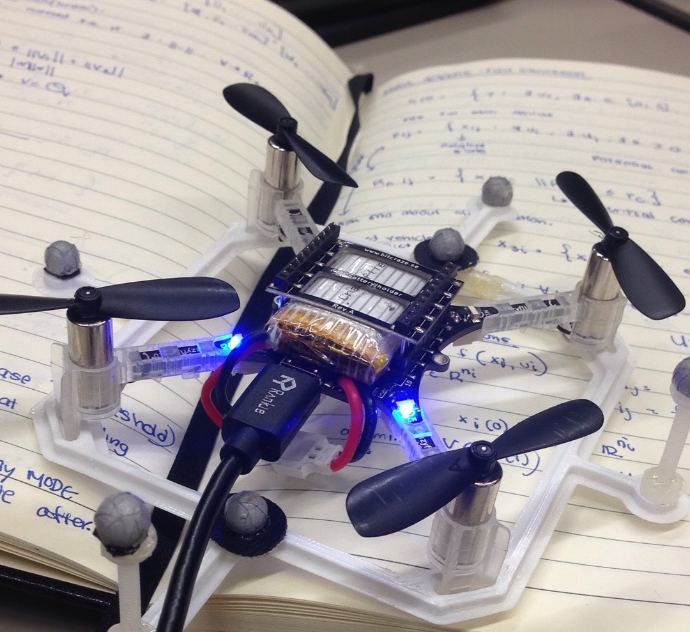
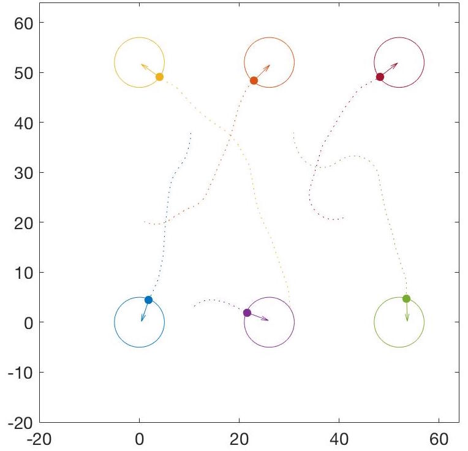
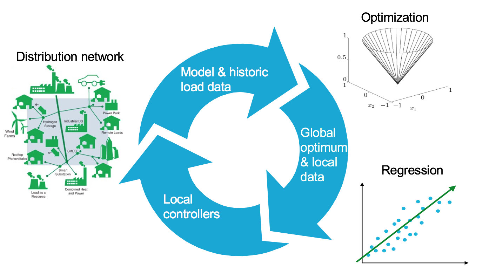
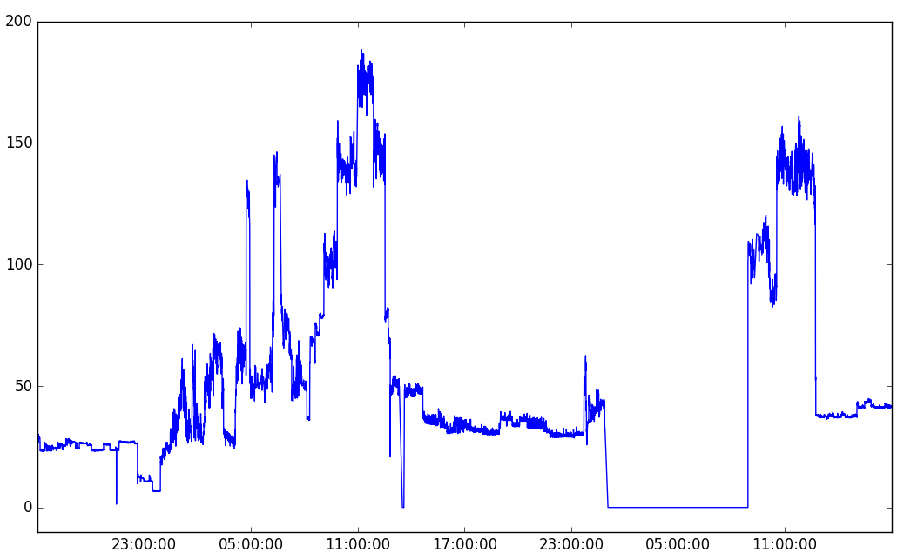
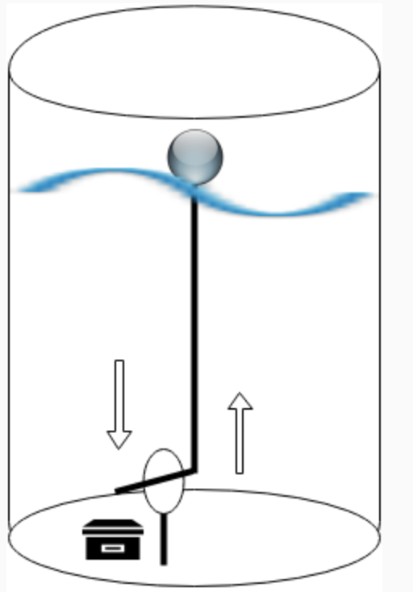
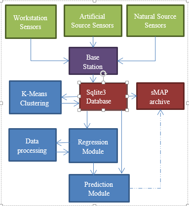

Current Research
----------------

#### Unmanned Aerial Vehicle Traffic Management

##### Collaborators: [Frank Jiang](http://fjiang.net) & [Mo Chen](https://people.eecs.berkeley.edu/~mochen72/index.html)
{class=project-pic width=250px}

Unmanned aerial vehicles(UAVs) are becoming immensely popular. As more projects like Amazon Prime Air and Google Project Wing begin to use UAVs for civilian services, Unmanned aerial systems Traffic Management (UTM) is needed to manage potentially thousands of flying vehicles to guarantee liveness and safety requirements. Using Hamilton-Jacobi (HJ) reachability analysis, airspace structure, and higher-level logic, safety and liveness for large numbers of vehicles can be guaranteed. One such approach is through [platooning](http://arxiv.org/abs/1503.07253). I am working on the hardware implementation using [Crazyflie 2.0](https://www.bitcraze.io/crazyflie-2/) as a proof of concept.

  

#### Multi-Vehicle Unstructured Collision Avoidance
##### Collaborators: [Glen Chou](https://www.linkedin.com/in/glen-chou-457292116) & [Mo Chen](https://people.eecs.berkeley.edu/~mochen72/index.html)
{class=project-pic width=250px}

Hamilton-Jacobi (HJ) reachability has successfully provided safety guarantees to small-scale systems and is flexible in terms of system dynamics. However, it becomes exponentially intractable when the number of vehicles is greater than two. Previously, our lab used a mixed integer program that exploits the properties of HJ solutions to provide higher-level control logic, thus providing safety guarantee for [three-vehicle systems](http://arxiv.org/abs/1603.05200). I am now working on a method to guarantee safety for more vehicles.

#### Regression-based Inverter Control for Optimal Power Flow & Voltage Regulation
##### Collaborators: [Roel Dobbe](https://www.linkedin.com/in/glen-chou-457292116)
{class=project-pic width=400px}

Electronic power inverters can quickly deliver reactive power to regulate voltage balances and reduce system losses in distribution grids. Previously, our lab proposed a systematic and data-driven [approach](http://repository.tudelft.nl/islandora/object/uuid:4535a9a5-6928-42c0-97b2-9df11f14ea64?collection=education) to determine reactive power inverter output as a function of local measurements in a manner that obtains near optimal results. This approach uses a single phase network model and historic load and generation data to do optimal power flow and then uses regresison to find a function for each inverter that serves as decentralized controlloers. I am now working with the three phase network model and determining a regression-based inverter control.

#### Cal Renewable and Adaptive Energy Micro-Grid Analysis
##### Collaborators: [Fujia Zhang](https://www.linkedin.com/in/fujia-zhang-b8733b95) & [Jalel Sager](http://newsunroad.com/#people)
{class=project-pic width=300px}

Cal–Renewable and Adaptive Energy (CAL-RAE) is a Berkeley interdisciplinary organization committed to addressing the energy challenges facing communities in the developing world. They have collaborated with [New Sun Road](http://newsunroad.com) and set up a microgrid in Kitoba, Uganda. Using their dataset, I am working on user classification based on voltage, load, power  signatures, demand predictions, and energy disaggregation from appliances.

-------

Past Research
-------------

#### Information Technologies for Agriculture
##### Collaborators: [Tsion Behailu](http://www.tsionbehailu.me) & [Tapan Parikh](http://tap2k.org)
{class=project-pic width=200px}

The 2008 World Development Report identifies agriculture as the primary engine for economic growth and poverty reduction in agriculture-based developing economies. Despite productivity increases in other parts of the developing world, agricultural production has stagnated in sub-Saharan Africa. Although there are numerous causes, it is evident that information for change is not easily accessible. Small-holders are not aware of the best agricultural practices and lack of opportunities to communicate with peers, suppliers, and customers limits the breadth and depth of information garnered. Few of these extension systems exploit the potential of Information and Communication Technologies (ICTs).

Inspired to integrate our computer science knowledge with real-world problems, we acquired fnding through [CREU](http://cra.org/cra-w/creu/) (funded by NSF and CRA-W) and worked with [Berkeley Represent Lab](http://represent.org) to design and develop ICTs to increase smallholder farmers' access to markets and knowledge. We worked on building a smart rainfall sensor and the accompanying software to increase agricultural small-holder productivity, profitability, and sustainability. Our aim was to predict the most lucrative crops based on water sensors and weather data. This research project was eye-opening to interdiscplinary research. We collaborated with a Kenyan farmer collective, and built a prototype. We also worked on analyzing [Avaaj Otalo](http://hci.stanford.edu/research/voice4all/), a voice-based social media platform, for Gujarat farmers.

#### Smart Lighting on the Smart Grid
##### Collaborators: Chandrayee Basu, Kyunam Kim, Jacob Richards, Benjamin Chen, Elizabeth Cheng, Alice Agogino
{class=project-pic width=300px}

The Berkeley Energy and Sustainable Technologies Laboratory [(BEST Lab)](http://best.berkeley.edu) has demonstrated that retrofitting zonal lighting control systems with wirelessly actuated, user-controlled, individually dimmable luminaires in offices can save 50% of the office’s electricity usage. “User-centric model-predictive lighting retrofit system” is an innovative approach to address the current deficiencies in intelligent lighting retrofits and also adds novel capabilities to the retrofitted system. Our primary contribution is in the development of a new framework/method for retrofitting that includes a combination of new hardware and software components. I worked on the software implementation of this project, from the database infrastructure, regression models, and K-Means clustering.

For more information, click [here](http://best.berkeley.edu/2013/07/19/375/)

-------

Publications
------------

* [**Sensor-based predictive modeling for smart lighting in grid-integrated buildings**](http://ieeexplore.ieee.org/document/6883131/)  
    Chandrayee Basu, Julien J Caubel, Kyunam Kim, Elizabeth Cheng, *Aparna Dhinakaran*, Alice Agogino, and Rodney Martin. IEEE Sensors Journal 2014.

* [**Affordable and personalized lighting using inverse modeling and virtual sensors**](http://spie.org/Publications/Proceedings/Paper/10.1117/12.2048681)  
    Chandrayee Basu, Benjamin Chen, Jacob Richards, *Aparna Dhinakaran*, Alice Agogino, Rodney Martin. SPIE 2014.

-------

Poster
------------

{class=profile width=800px }

